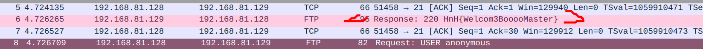
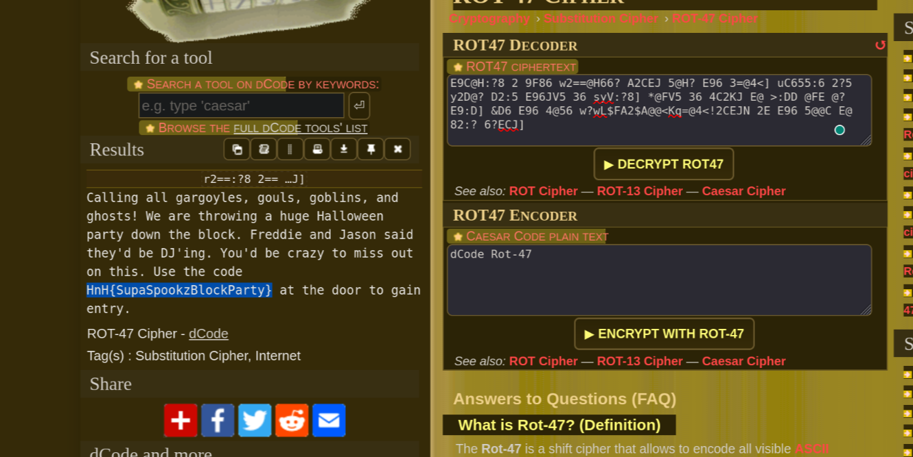
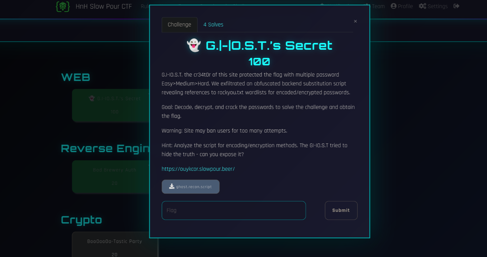
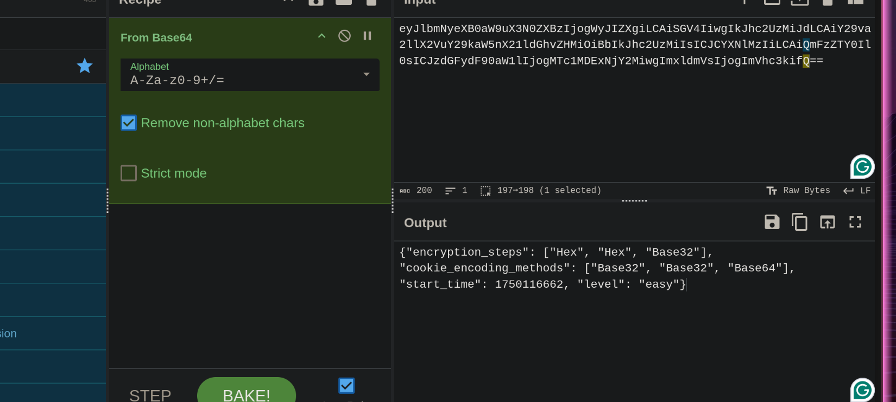
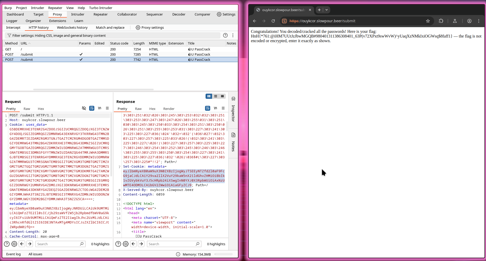

# HnH Slow Pour CTF - Writeups

I recently solved the Monthly [HnH Slow Pour CTF](https://hnh.slowpour.beer/)
Organized by [Hacker's and Hops](https://hackersnhops.substack.com/)

It was fun as I solved all the challs in about 2-3 hours and the overall event was on an easier side.

It had web, crypto, osint, reversing, network forensics as well as an Intro miscellaneous challenge.

---

## Chall - 1
```json
{
	"Name": "Gremlins on the Wire 1",
	"Points": 5,
	"Category": "Network Forensics",
	"Description": "The Brewmaster File server has gremlins in the system! They are making a mess of things! Our beer recipes are missing. Hopefully, those were backed up somewhere. For now we just want to understand some of the behavior in this PCAP that Jack captured. What is the banner of the service the remote system connected to?" 	
}
```
[Download Challenge Resource](./network/spookycap.zip) 

It was a simple challege that required us to download the resource and extract the contents of the zip

```bash
..folder network && wget 'https://hnh.slowpour.beer/files/c45c42811c0a5c7287a3568358a6f303/spookycap.zip?token=eyJ1c2VyX2lkIjoxMDEsInRlYW1faWQiOjY1LCJmaWxlX2lkIjoyOX0.aFDwUQ.9eXXFwRa6ajikewRA7vVohTyiRc' && mv spookycap.zip?token=eyJ1c2VyX2lkIjoxMDEsInRlYW1faWQiOjY1LCJmaWxlX2lkIjoyOX0.aFDwUQ.9eXXFwRa6ajikewRA7vVohTyiRc spookycap.zip
```
`Note: here ..folder is a custom alias for mkdir -p and cd at the same time to a folder being created`

then
```bash
❯ extract network/spookycap.zip
Archive:  network/spookycap.zip
  inflating: spooky.pcap   
```

From the zip file you get `spooky.pcap` which is Packet Capture file which keeps a digital log of the network and can easily accessed by `wireshark`

By studying the packets a bit I found the flag hidden in plain sitght




Another method would have been
```bash
grep -a "HnH{" spooky.pcap
```

and then there were a few dozen fake flags and one real one

```json
{
	"flag": "HnH{Welcom3BooooMaster}"	
}
```
---

## Chall - 2
```json
{
	"Name": " Welcome Challenge",
	"Points": 5,
	"Category": "Misc",
	"Description": "Welcome to the Hackers N' Hops Slow Pour CTF! 🍺 Before diving into the technical challenges, we need all participants to read and acknowledge our Code of Conduct. This isn't just bureaucratic paperwork - it's essential for maintaining a positive learning environment for everyone. Your mission: Navigate to the Code of Conduct page and thoroughly read through all the guidelines. Show us you've read everything by finding the hidden agreement mechanism. This is basically free points for doing what every good CTF participant should do anyway - understanding the rules! Plus, you might learn something about how we approach cybersecurity education at HnH.",
	"Hint": "Sometimes the best flags come to those who... scroll with patience. 😉 Note: This challenge requires no technical exploitation - just good old-fashioned reading comprehension and a willingness to follow directions."
}
```

While wondering about the website I found an alert on the `/rules` which was the flag to this challenge 🤫.

```json
{
	"flag": "HnH{!_4gr33_t0_th3_rul3s!}"	
}
```
---

## Chall - 3
```json
{
	"Name": "Digital Archaeology",
	"Points": 10,
	"Category": "OSINT & RECON",
	"Description": "The Hackers N' Hops community has always believed that the best stories are told in layers. What you see on the surface is just the beginning — there's always more above. Every great platform has an origin story, and experienced CTF participants know that these foundational narratives often contain overlooked details that reveal more than initially apparent. The creators of this platform have woven their history throughout the site in various ways.",
	"Challenge": "The HnH team has embedded something special within their digital presence. Sometimes the most significant discoveries come from examining elements that others might dismiss as insignificant. Navigate through the platform and investigate what lies beneath the polished presentation.",
	"Hint": "Not all treasures are displayed prominently. Some require a closer look at the craftsmanship itself."	
}
```

This one took some time, although this was not hard.

While rooming about the website I just open the developer tools while accessing the home page `/` and used `CTRL+F` to search the flag initial `HnH{`

And there it was `hidden` inside a hidden span

```html
<span style="position: relative;">
	🚩
	<span class="hidden">
		HnH{So0o0_t!ny}
	</span>
</span>
```

so the flag is 

```json
{
	"flag": "HnH{So0o0_t!ny}"	
}
```
---

## Chall - 4
```json
{
	"Name": "BooOooOo-Tastic Party",
	"Points": 20,
	"Category": "Crypto",
	"Description": "Some slithering serpants posted a flyer up in the Witch's Washroom. We've asked everyone at the Haunted Brewery if they could make sense of it but we've hit a \"dead end\". Flag is the code used to gain entry to the event." 	
}
```

The Encrypted Text
```yaml
r2==:?8 2== 82C8@J=6D[ 8@F=D[ 8@3=:?D[ 2?5 89@DEDP (6 2C6 E9C@H:?8 2 9F86 w2==@H66? A2CEJ 5@H? E96 3=@4<] uC655:6 2?5 y2D@? D2:5 E96JV5 36 syV:?8] *@FV5 36 4C2KJ E@ >:DD @FE @? E9:D] &D6 E96 4@56 w?wL$FA2$A@@<Kq=@4<!2CEJN 2E E96 5@@C E@ 82:? 6?ECJ]
```

I did not take the hint.
so, it was all just my shear will to solve the challenge.

I opened the [dcode.fr](https://www.dcode.fr/en) and used the cipher Identifer tool - It said ROT 47

which I applied and Voilà I got the flag
```text
Calling all gargoyles, gouls, goblins, and ghosts! We are throwing a huge Halloween party down the block. Freddie and Jason said they'd be DJ'ing. You'd be crazy to miss out on this. Use the code HnH{SupaSpookzBlockParty} at the door to gain entry.
```



Although from the text I thought it to be some kind of serpent cipher and I did spend quite some time figuring out if it was related to the serpant AES enryption.

which it was not.

```json
{
	"flag": "HnH{SupaSpookzBlockParty}"	
}
```
---

## Chall - 5
```json
{
	"Name": "Bad Brewery Auth",
	"Points": 20,
	"Category": "Reverse Engineering",
	"Description": "We've upgraded our brewery authentication terminals. These changes should prevent non-gargoyle patrons from receiving free brews! One of gouls said they thought the terminal authentication could be bypassed. Analyze the following code and see if you can bypass the authentication. Flag: What value must a patron's badge read to get a free beer at the Haunted Brewery's upgraded terminal?" 	
}
```
Here[Download Challenge Resource](./rev/challenge.js)

I insatlled the given javascript file using `wget` and openned it.

While studying the code I saw an encrypted text inside a `var`
``` js
var hTierMem = Buffer["from"](
  "SG5Ie09iZnVzY2F0aW9uSXNBbHNvTm90RW5jcnlwdGlvbn0=",
  "base64"
);
```

I used decode the base 64 encryption using 
```bash
❯ echo "SG5Ie09iZnVzY2F0aW9uSXNBbHNvTm90RW5jcnlwdGlvbn0=" | base64 -d
	HnH{ObfuscationIsAlsoNotEncryption}
```

Which gave me the flag.

```json
{
	"flag": "HnH{ObfuscationIsAlsoNotEncryption}"	
}
```
---

## Chall - 6
```json
{
	"Name": "👻 G.|-|O.S.T.’s Secret ",
	"Points": 100,
	"Category": "OSINT & RECON",
	"Description": "G.|-|O.S.T. the cr34t0r of this site protected the flag with multiple password Easy>Medium>Hard. We exfiltrated an obfuscated backend substitution script revealing references to rockyou.txt wordlists for encoded/encrypted passwords.",
	"Goal": "Decode, decrypt, and crack the passwords to solve the challenge and obtain the flag.",
	"Warning": "Site may ban users for too many attempts.",
	"Hint": "Analyze the script for encoding/encryption methods. The G|-|O.S.T tried to hide the truth - can you expose it?"	
}
```

The website can be accessed [here!](https://ouykcor.slowpour.beer/)

and we were provided by a [file](./web/ghost.recon.script) which I did not use.



I just opened the challenge with `Burpsuite` community edition obv.

And saw each request had metadata and user data.

And metadata was base64 encrypted, on decrypting it with `cyberchef` I found it to be json data, jwt for the encryption type of both the userdata and the password.

the I reversed the encryption using online tools.

For the **EASY** one we only had 60 seconds which were very less but after checking my solution did work but i could not submit my answer within time.


So I tried writing a pyhthon script to which I will provide both the user data and the metadata and it would give me the decrypted flag. 

Although I could have automated the whole thing includuing post requests but I did not as it would not be worth the time invested.



<h2>Level wise Encryption</h2>
<ol>
<li><h3>Easy</h3>
It had:
<ul>
	<li>Base64</li>
	<li>Base32</li>
	<li>Base16 or Hex</li>
	<li>Rot 13</li>
</ul>
</li>
<li>
<h3>Medium</h3>
It had:
<ul>
	<li>MD5</li>
	<li>Reverse</li>
</ul>
</li>
<li>
<h3>Hard</h3>
It had:
<ul>
	<li>SHA Encryption</li>
	<li>Some Modren Encryption</li>
</ul>
And Involed the use of epoch. Which was nothing but time of epoch which was actually provided within the json response of the userdata.
</li>
</ol>

When writing the python script Im used `AI` to modify my initial script for `Medium` and `Hard` level.

I used Two scripts, one for `easy` `medium` `part hard` and the other one for Modren Encryption involved in `hard`, it used `rockyou.txt`.

link to resources:
1. [Rock You](https://github.com/Jayesh-Dev21/Rock-You)
2. [Python Script - 1](./web/python_web.py)
3. [Python Script - 2](./web/new.py)

**ROCKYOU**
```
It is a wordlist of the most commonly used passswords around the world, it has about 14,341,564 unique passwords, used in 32,603,388 accounts, and was released in a data breach.
```

**Python Script - 2**
```
Provide it with the password from the website and epoch time of Hard level from script - 1,
Then it scans all of the rockyou.txt with similar SHA256 as the encrypted password.

Format is 'Password text' + 'Epoch'
```

**Python Script - 1**
```
It is a simple script to which encoded metadata is given, then it decodes the base64 encryption,
finds the current encryption for the userdata, both the userdata nad metadata can be found using Burpsuite.

And the it decrypts the three layer encryption in as few seconds and the prints our answer.

Mind it, this can fully work to decrypt only in case of level easy & medim not is hard. 
```

<h3>Why SHA-256 can not be broken?</h3>

<h4>These encryptions arebroken by creating files and finding there encryptions, as each file is different, they also have different SHA-256 encryption, so if two encryptions are same although the files are different then it is called as an file hash collision, it is further refered in the paragraph below.</h4>

<p>It will take a very, very, very, veryvery long time to find one. For comparison, as of January 2015, Bitcoin was computing 300 quadrillion SHA-256 hashes per second. That's 300×1015 hashes per second.

Let's say you were trying to perform a collision attack and would "only" need to calculate 2128 hashes. At the rate Bitcoin is going, it would take the 2128/(300×1015⋅86400⋅365.25)≈3.6×1013 years. In comparison, our universe is only about 13.7×109 years old. Brute-force guessing is not a practical option.
</p>

That's why we needed a new script to decode, as we knew that that password was from the `rockyou wordlist`, But the future of SHA-256 is not that bright, due to quantum computing and parallel technologies `Google` is talking about, which utilizes qubit instead of standard bits.



```json
{
	"flag": "HnH{*761:@iHM7UUtJzJbwMGQB#980401311386308401_63P(v72XPxt9swWvW)^yUaqXzNMkIxiOGWsq$8faff1}"	
}
```
---

That's how I solved HnH Slow Pour CTF, and finished forth.
```json
{
	"username": "MarshmalloQi",
	"team_name": "T3R3_B1N",
	"points": 160,
	"position": 4,
}

---
```
I hope you liked reading my solutions, and learnt something new.