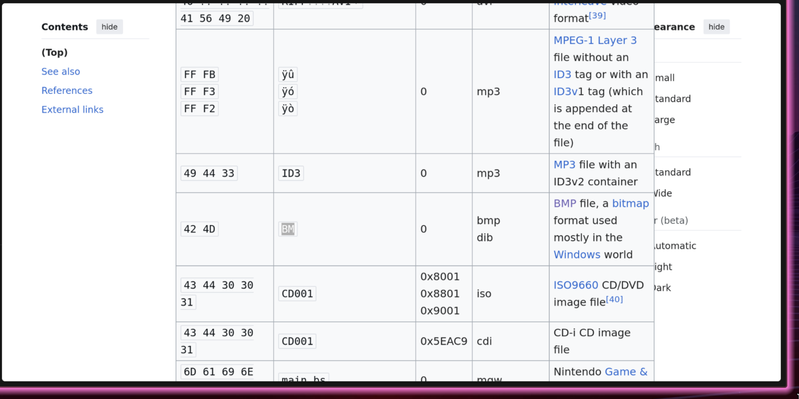
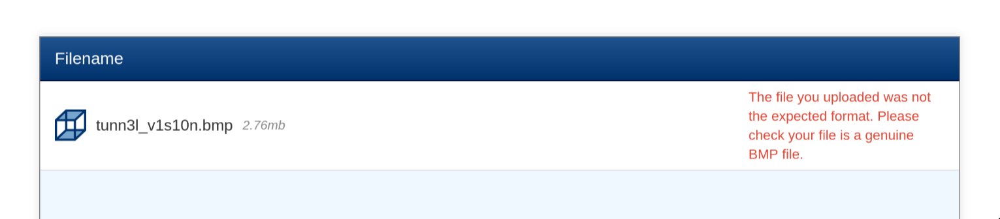
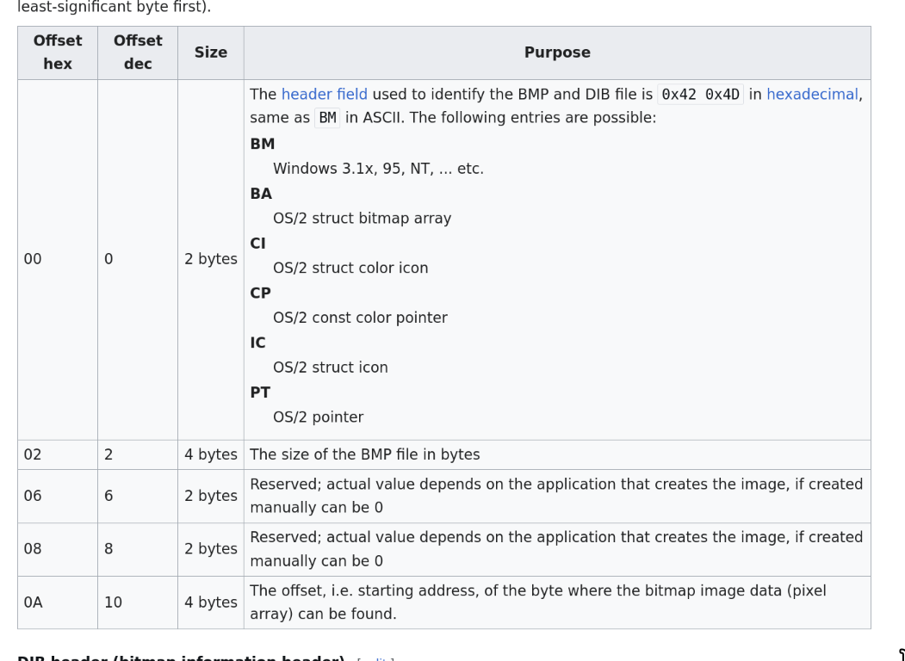
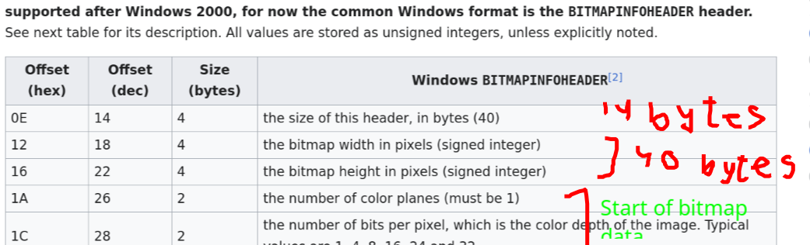
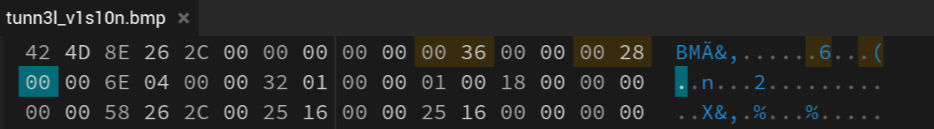
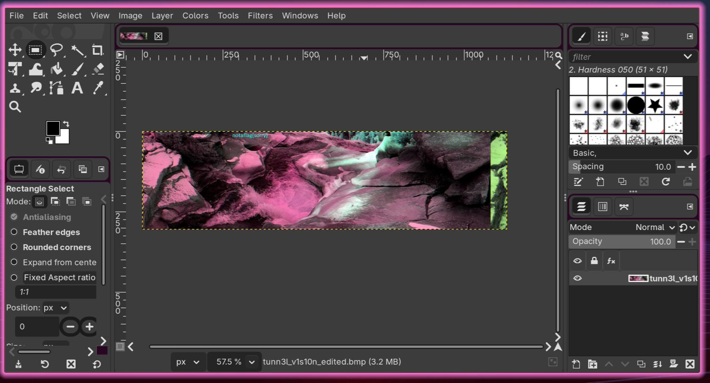
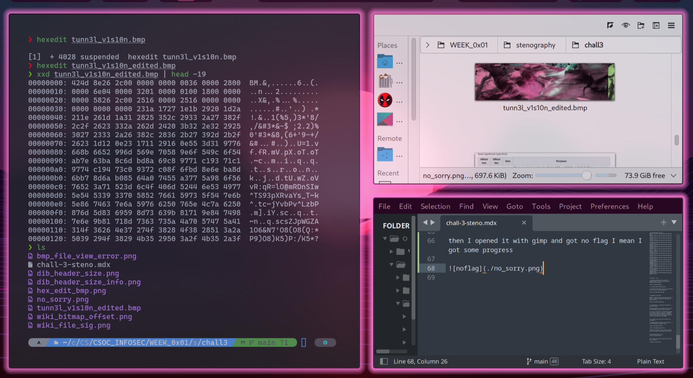
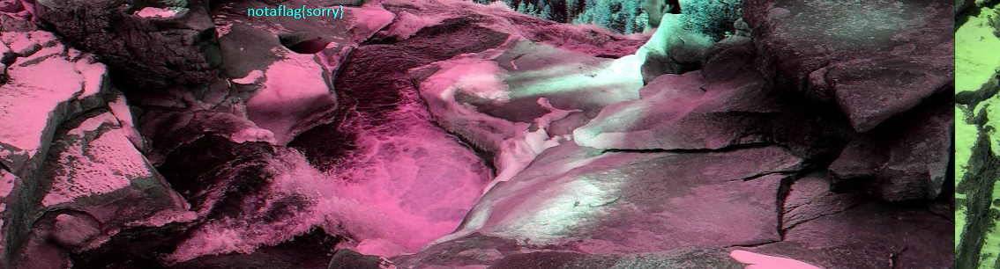
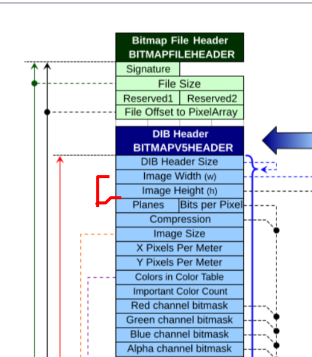
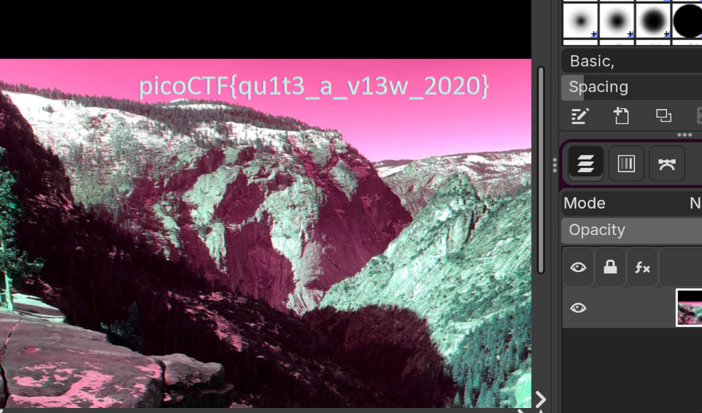

# Tunnel Vision

❯ xxd tunn3l_v1s10n | head -5

00000000: 424d 8e26 2c00 0000 0000 bad0 0000 bad0  
	BM.&,.........3..

00000010: 0000 6e04 0000 3201 0000 0100 1800 0000  
	.n...2.........

00000020: 0000 5826 2c00 2516 0000 2516 0000 0000 
	..X&,.%...%.....

00000030: 0000 0000 0000 231a 1727 1e1b 2920 1d2a  
	......#..'..) .*

00000040: 211e 261d 1a31 2825 352c 2933 2a27 382f  
	!.&..1(%5,)3*'8/

---


file header - 42 4D 

on searching on wikipedia for various file signatures found it to match with bitmap and changed it file extension



❯ mv tunn3l_v1s10n tunn3l_v1s10n.bmp

on viewing the file online it gave error and stated that it was not of the expected format




on reading hex data again 

00000000: 424d(file header) 8e26 2c00 (file size in bytes - 2,893,454 in big endian) 0000 0000 bad0 0000 bad0  BM.&,...........




on reading about it I found that the header of a bmp is of 14 bytes

Thus studying gives a clear idea on how we need to edit the header to get the correct bmp bitmap

as the size of dib info is 40 bytes and the header is 14 bytes but the file  shows hex - 0xbad0(big endian) which is 53434 in decimal, this instead should have the the end of the header and dib info as from the the data for bitmap begins


now I used hex edit to edit the hex data of the provided bmp.

by changing 0xbad0 to 0x36(54 [14 bytes header + 40 bytes dib header]) and 0x28(40 bytes)




showing that the total header is 54 bytes and the size of dib header is also wrong and is 40 bytes.


After editing the Bitmap I get



then I opened it with gimp and got no flag I mean I got some progress





---
[Wiki Article on BMP](https://en.wikipedia.org/wiki/BMP_file_format#DIBs_in_memory) -- I used this article on bitmap data files

---



---


On reading more about bmp file data, I found that these images had equal number of rows and colums but while looking at its metadata I found its size to be `1134x306`

```bash
❯ exiftool tunn3l_v1s10n.bmp
ExifTool Version Number         : 13.25
File Name                       : tunn3l_v1s10n.bmp
Directory                       : .
File Size                       : 2.9 MB
File Modification Date/Time     : 2025:06:20 07:16:00+05:30
File Access Date/Time           : 2025:06:20 07:16:01+05:30
File Inode Change Date/Time     : 2025:06:20 07:16:00+05:30
File Permissions                : -rw-r--r--
File Type                       : BMP
File Type Extension             : bmp
MIME Type                       : image/bmp
BMP Version                     : Unknown (53434)
Image Width                     : 1134
Image Height                    : 306
Planes                          : 1
Bit Depth                       : 24
Compression                     : None
Image Length                    : 2893400
Pixels Per Meter X              : 5669
Pixels Per Meter Y              : 5669
Num Colors                      : Use BitDepth
Num Important Colors            : All
Red Mask                        : 0x27171a23
Green Mask                      : 0x20291b1e
Blue Mask                       : 0x1e212a1d
Alpha Mask                      : 0x311a1d26
Color Space                     : Unknown (,5%()
Rendering Intent                : Unknown (826103054)
Image Size                      : 1134x306
Megapixels                      : 0.347
```



so the width and the height are after the DIB header and 1134x306 comes out to be `347004` so I first tried taking rot of it and assigning its value to both height and width though I didn't get the flag but by increaing the height I did get some upper portion of the data file,

then I tried experimenting with random bytes, and at last, I got the flag.




Flag  -  picoCTF{qu1t3_a_v13w_2020}