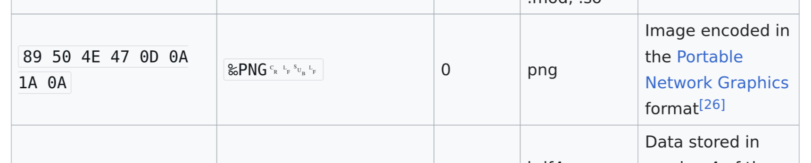
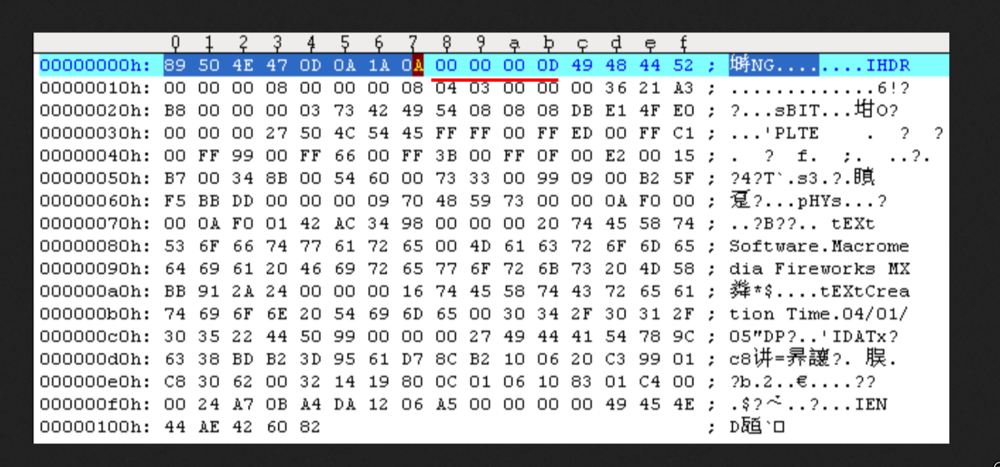
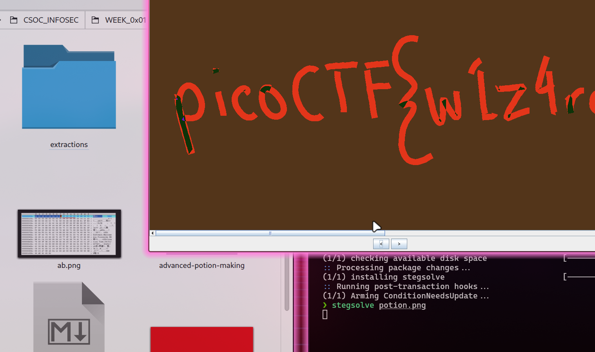

# advanced-potion-making

Checked the file signatures;
Almost matched with png now edit the hexdata using hexedit

```bash
❯ xxd advanced-potion-making | head -n 10
00000000: 8950 4211 0d0a 1a0a 0012 1314 4948 4452  .PB.........IHDR
00000010: 0000 0990 0000 04d8 0802 0000 0004 2de7  ..............-.
00000020: 7800 0000 0173 5247 4200 aece 1ce9 0000  x....sRGB.......
00000030: 0004 6741 4d41 0000 b18f 0bfc 6105 0000  ..gAMA......a...
00000040: 0009 7048 5973 0000 1625 0000 1625 0149  ..pHYs...%...%.I
00000050: 5224 f000 0076 3949 4441 5478 5eec fd61  R$...v9IDATx^..a
00000060: 72e3 4c94 a659 ce16 6afe 76cd fe57 d7dd  r.L..Y..j.v..W..
00000070: 5b18 45e9 4b8a 7a28 d19d 2048 07a9 6376  [.E.K.z(.. H..cv
00000080: ac2d 2b3e bfaf 5f07 1801 82d7 b2f3 fff3  .-+>.._.........
00000090: fffc 7fff 7f00 0000 0000 0000 4b18 5802  ............K.X.
```



so I did this
```bash
❯ cp advanced-potion-making potion.png
❯ hexedit potion.png
❯ xxd potion.png | head -n 2
00000000: 8950 4e47 0d0a 1a0a 0012 1314 4948 4452  .PNG........IHDR
00000010: 0000 0990 0000 04d8 0802 0000 0004 2de7  ..............-.

but the image still won't open

```bash
❯ exiftool potion.png
ExifTool Version Number         : 13.25
File Name                       : potion.png
Directory                       : .
File Size                       : 30 kB
File Modification Date/Time     : 2025:06:20 09:03:58+05:30
File Access Date/Time           : 2025:06:20 09:03:59+05:30
File Inode Change Date/Time     : 2025:06:20 09:03:58+05:30
File Permissions                : -rw-r--r--
File Type                       : PNG
File Type Extension             : png
MIME Type                       : image/png
Warning                         : Corrupted PNG image
```

Which said that the png is corrupted, so I searched a bit for more header information as I had only corrected the file signaturtes 

then I found that I need to edit the next four bytes as well



so I did that as well

and got 


Then I used stegsolve as it was a single colour image




and I got the flag on random color map 2

flag     -   picoCTF{w1z4rdry}

we could have used online tools like stegsolve online or aperisolve (but it takes alot of time and reveals the answer to others as well, as it stores the images and thre hashes and possible flags) -- 
{I have faced this problem in previous ctfs}