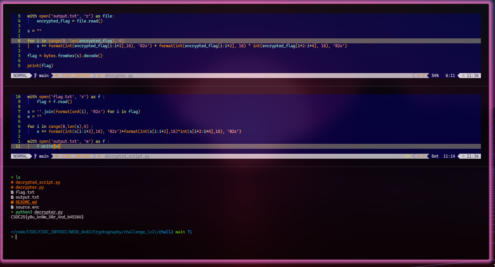

# Challenge - 1 {Crypto} [Sub Chall 2]

on looking at the source.enc, it was base64 encrypted

I used 

```bash
> cat source.enc > decrypted_script.py
```

```python
with open('flag.txt', 'r') as f :
    flag = f.read()

s = ''.join(format(ord(i), '02x') for i in flag)
e = ""

for i in range(0,len(s),4) :
    e += format(int(s[i:i+2],16), '02x')+format(int(s[i:i+2],16)^int(s[i+2:i+4],16), '02x')

with open('output.txt', 'w') as f :
    f.write(e)
```

Then I wrote decrypter script for output.txt

```txt
43104f0c32077b0230455f346e5e77285868722d345a643b6256350636027d77
``` 

and the script

```python
with open('output.txt', 'r') as file:
    encrypted_flag = file.read()

s = ""

for i in range(0, len(encrypted_flag), 4):
    s += format(int(encrypted_flag[i:i+2],16), '02x') + format(int(encrypted_flag[i:i+2], 16) ^ int(encrypted_flag[i+2:i+4], 16), '02x')

flag = bytes.fromhex(s).decode()

print(flag)

with open('flag.txt', 'w') as f :
    f.write(flag)
```

```bash
> cat flag.txt
CSOC25{y0u_kn0w_X0r_4nd_b45364}
```


