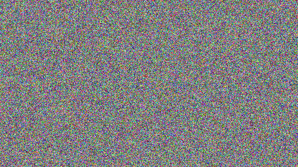

# Challenge - 2 {Crypto} [Sub Chall 2] General/XOR

**XOR STARTER**
```python
ll = "label"

chai = ""

for c in ll:
  t = ord(c)^13
  chai += chr(t)
  
print("crypto{"+chai+"}")
```

```
flag - crypto{aloha}
```

---

**XOR PROPERTIES**

```python
KEY1 = "a6c8b6733c9b22de7bc0253266a3867df55acde8635e19c73313"
KEY2_KEY1 = "37dcb292030faa90d07eec17e3b1c6d8daf94c35d4c9191a5e1e"
KEY2_KEY3 = "c1545756687e7573db23aa1c3452a098b71a7fbf0fddddde5fc1"
FLAG_KEY1_KEY3_KEY2 = "04ee9855208a2cd59091d04767ae47963170d1660df7f56f5faf" 

k1 = bytes.fromhex(KEY1)
k2_k1 = bytes.fromhex(KEY2_KEY1)
k2_k3 = bytes.fromhex(KEY2_KEY3)
f_k1_k2_k3 = bytes.fromhex(FLAG_KEY1_KEY3_KEY2)


def xor_bytes(bytes1, bytes2):
  return bytes(x ^ y for x, y in zip(bytes1, bytes2))

k2 = xor_bytes(k1, k2_k1)
k3 = xor_bytes(k2, k2_k3)

f = xor_bytes(xor_bytes(xor_bytes(f_k1_k2_k3,k3),k2),k1)


flag = f.decode('latin-1')

print(flag)

```
[zip()](https://docs.python.org/3.3/library/functions.html#zip)
```
flag - crypto{x0r_i5_ass0c1at1v3}
```

---

**Favourite byte**
```python
hex = "73626960647f6b206821204f21254f7d694f7624662065622127234f726927756d" 

bytes_from_hex = bytes.fromhex(hex)
print(bytes_from_hex)
fav = ord('s')^ord('c')
flag = ""
for bh in bytes_from_hex:
  f = bh^(fav)
  flag += chr(f)
print(flag)
```
```
flag - crypto{0x10_15_my_f4v0ur173_by7e}
```
as I knew that lag starts with c 

I took xor of c with the first byte given mand got 16
so favorite byte came out to be `16`

---

** **

on running
```python
hex = "0e0b213f26041e480b26217f27342e175d0e070a3c5b103e2526217f27342e175d0e077e263451150104" 

bytes_from_hex = bytes.fromhex(hex)
print(bytes_from_hex)
key = []

for bh in bytes_from_hex:
  key.append(bh)
kk = ""
print()
part_flag = "crypto{"
i = 0
for c in part_flag:
  c_int = ord(c)
  g = key[i]^c_int
  i += 1
  kk += chr(g)
  print(chr(g))

print(kk + chr(key[len(key)-1]^ord('}'))
```

I got `myXORkey` and tried 

```python
hex = "0e0b213f26041e480b26217f27342e175d0e070a3c5b103e2526217f27342e175d0e077e263451150104" 

bytes_from_hex = bytes.fromhex(hex)
print(bytes_from_hex)
byte_s = []

for bh in bytes_from_hex:
  byte_s.append(bh)
key = "myXORkey"
flag = ""
part_flag = "crypto{"
i = 0

for i in range(len(byte_s)):
  
  c_int = ord(key[i%len(key)])
  g = byte_s[i]^c_int
  flag += chr(g)
  # print(chr(g))
print(flag)
```

```
flag - crypto{1f_y0u_Kn0w_En0uGH_y0u_Kn0w_1t_4ll}
```

---

**Lemur XOR**



and 


I found a website which had exxplained how to take xor of two images using openCV
-- https://www.tutorialspoint.com/how-to-perform-bitwise-xor-operation-on-images-in-opencv-python

```python
flag_img = "./flag_7ae18c704272532658c10b5faad06d74.png"
lemur_img = "./lemur_ed66878c338e662d3473f0d98eedbd0d.png"

import cv2

# Read two images. The size of both images must be the same.
img1 = cv2.imread(flag_img)
img2 = cv2.imread(lemur_img)

# compute bitwise XOR on both images
xor_img = cv2.bitwise_xor(img1,img2)

# display the computed bitwise XOR image
cv2.imshow('Bitwise XOR Image', xor_img)
cv2.waitKey(0)
cv2.destroyAllWindows()
```


```
flag - crypto{X0Rly_n0t!}
```

---
