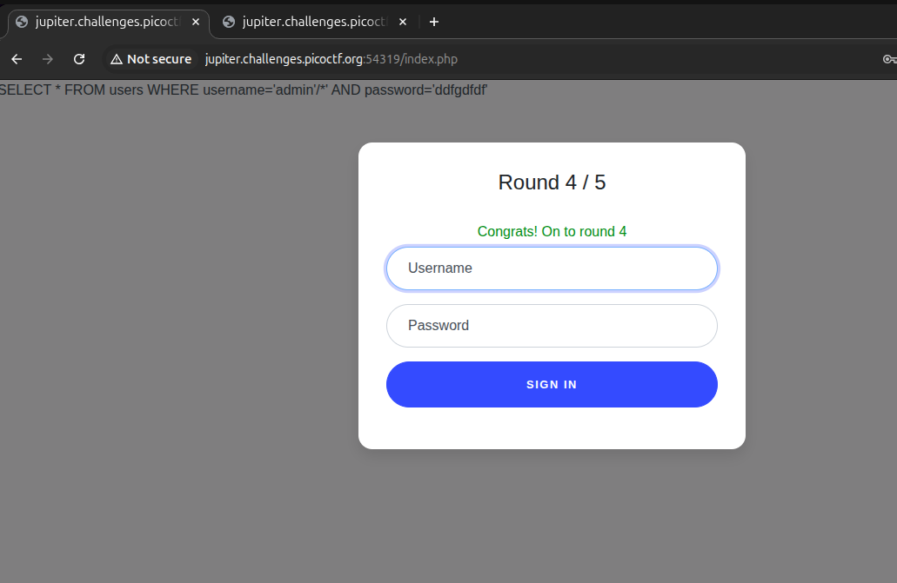
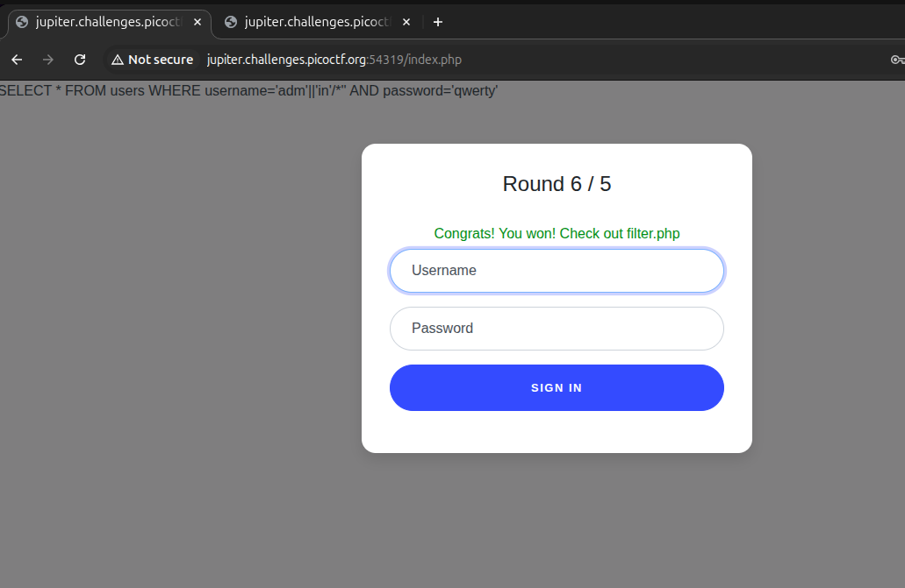
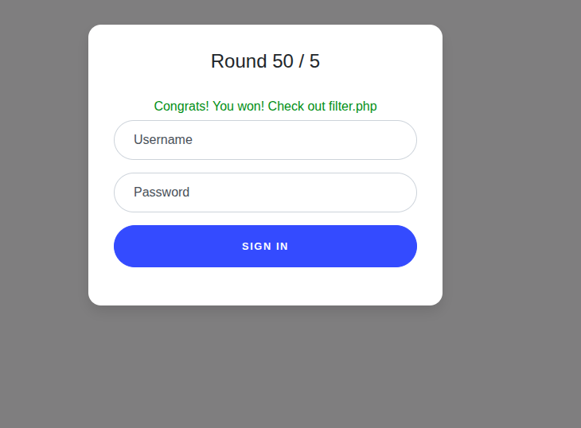

# Web Gauntlet - 1

link to the chall - [link](https://play.picoctf.org/practice/challenge/88?page=1&search=web)

---
<video src="./web-gauntlet1sol.mp4" type="video/mp4"></video>

We are given two sites, and we have to log in as the `admin` 


going the through the filters for the Round 1 
The given filter is `Round1: or`

and I tried some giberish at the login and got 
`SELECT * FROM users WHERE username='admin' AND password='passwd'
`

so going through some [sql injections](https://www.invicti.com/blog/web-security/sql-injection-cheat-sheet/) I used commnets `' --` in the username

and cleared round 1.

---

on reloading the filters page we now have `Round2: or and like = --` as a filter

so I used `/* */` multiline comment this time


---

Now the next filter was `Round3: or and = like > < --` the same thing as round two worked here but I had to remove the space, I guessn they had ' ' also as a filter.



---

The next filter was `Round4: or and = like > < -- admin` so using something like a `||` for `admin` will work.

It did. Yay!!


---

The final round now, so the filter is `Round5: or and = like > < -- union admin`

so I reused my injection again,

and yay!
 

---
Now at the filter page 

```php
<?php
session_start();

if (!isset($_SESSION["round"])) {
    $_SESSION["round"] = 1;
}
$round = $_SESSION["round"];
$filter = array("");
$view = ($_SERVER["PHP_SELF"] == "/filter.php");

if ($round === 1) {
    $filter = array("or");
    if ($view) {
        echo "Round1: ".implode(" ", $filter)."<br/>";
    }
} else if ($round === 2) {
    $filter = array("or", "and", "like", "=", "--");
    if ($view) {
        echo "Round2: ".implode(" ", $filter)."<br/>";
    }
} else if ($round === 3) {
    $filter = array(" ", "or", "and", "=", "like", ">", "<", "--");
    // $filter = array("or", "and", "=", "like", "union", "select", "insert", "delete", "if", "else", "true", "false", "admin");
    if ($view) {
        echo "Round3: ".implode(" ", $filter)."<br/>";
    }
} else if ($round === 4) {
    $filter = array(" ", "or", "and", "=", "like", ">", "<", "--", "admin");
    // $filter = array(" ", "/**/", "--", "or", "and", "=", "like", "union", "select", "insert", "delete", "if", "else", "true", "false", "admin");
    if ($view) {
        echo "Round4: ".implode(" ", $filter)."<br/>";
    }
} else if ($round === 5) {
    $filter = array(" ", "or", "and", "=", "like", ">", "<", "--", "union", "admin");
    // $filter = array("0", "unhex", "char", "/*", "*/", "--", "or", "and", "=", "like", "union", "select", "insert", "delete", "if", "else", "true", "false", "admin");
    if ($view) {
        echo "Round5: ".implode(" ", $filter)."<br/>";
    }
} else if ($round >= 6) {
    if ($view) {
        highlight_file("filter.php");
    }
} else {
    $_SESSION["round"] = 1;
}

// picoCTF{y0u_m4d3_1t_a5f58d5564fce237fbcc978af033c11b}
?>
```

---
And the flag - `picoCTF{y0u_m4d3_1t_a5f58d5564fce237fbcc978af033c11b}`

---

Interesting thing- if we keep reloading after the completing all rounds then then the count keeps increasing

