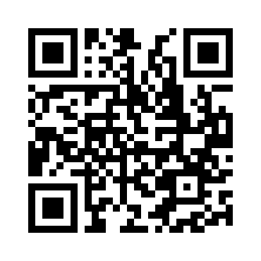

# Java Script Kidde - 1

link to the chall - [link](https://play.picoctf.org/practice/challenge/29?page=1&search=script%20kiddie&solved=0)

---


---

I solved the challenge ,

First I observed the js code

```js

			var bytes = [];
			$.get("bytes", function(resp) {
				bytes = Array.from(resp.split(" "), x => Number(x));
			});

			function assemble_png(u_in){
				var LEN = 16;
				var key = "0000000000000000";
				var shifter;
				if(u_in.length == LEN){
					key = u_in;
				}
				var result = [];
				for(var i = 0; i < LEN; i++){
					shifter = key.charCodeAt(i) - 48;
					for(var j = 0; j < (bytes.length / LEN); j ++){
						result[(j * LEN) + i] = bytes[(((j + shifter) * LEN) % bytes.length) + i]
					}
				}
				while(result[result.length-1] == 0){
					result = result.slice(0,result.length-1);
				}
				document.getElementById("Area").src = "data:image/png;base64," + btoa(String.fromCharCode.apply(null, new Uint8Array(result)));
				return false;
			}
		
```

and ran 
```js
console.log(bytes);
```

in the browsers console and got the shuffled array of bytes,

I using a command 

```bash
xxd ../../../../CSOC_INFOSEC/WEEK_0x01/OSINT/Sakura/task-3/name.png | head -n 1 | cut -d ':' -f2 | cut -d '.' -f1 | tr -d ' ' | python3 -c "hex_str=input();  print([int(hex_str[i:i+2], 16) for i in range(0, len(hex_str), 2)])"

# [137, 80, 78, 71, 13, 10, 26, 10, 0, 0, 0, 13, 73, 72, 68, 82]
```

I got the standard initial bytes of a png that are common to all pngs. The png code at the end of js script in browser had `png` which hinted involvement of PNGs.


Then I wrote a basic c++ script, that would loop over the index of key and bruteforce the value of the key `called shifter` here, and if the initial 16 bytes of the result matches that of a pngs then the key is correct.

```c++
#include <iostream>
using namespace std;

int main() 
{
    int png_bytes[] = 
    {137, 80, 78, 71, 13, 10, 26, 10, 0, 0, 0, 13, 73, 72, 68, 82};
    
    int image_bytes[] = {156,255,80,255,117,10,239,248,152,253,...}; //read the attached c++ script for the whole byte array
 
  int LEN = 16;
  int img_len = 704;
  int result[720];
  int key[16];
  // value not known
  for(int i = 0; i < LEN; i++){
    int k = 0;
    for(k = 0; k < 10; k++){
      for(int j = 0; j < img_len/16; j++){
        result[(j * LEN) + i] = image_bytes[(((j + k) * LEN) % img_len) + i];
      }
      int a = 0;
      
      if(result[i] == png_bytes[i]) {
        key[i] = k;
        break;
      }

    }
    std::cout << key[i];
    
  }
  std::cout << "\n";
}
```

after running I got the key as - `6696705967835463`

I tried this key on the website, which gave a qr code



I used `zbarimg` command and got

```bash
» zbarimg Untitled.png
# QR-Code:picoCTF{ce96332407ef1381c0bcc59e4154afc8}
# scanned 1 barcode symbols from 1 images in 0.01 seconds
```

the flag is - `picoCTF{ce96332407ef1381c0bcc59e4154afc8}`